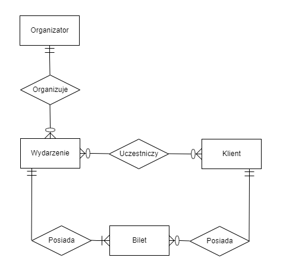
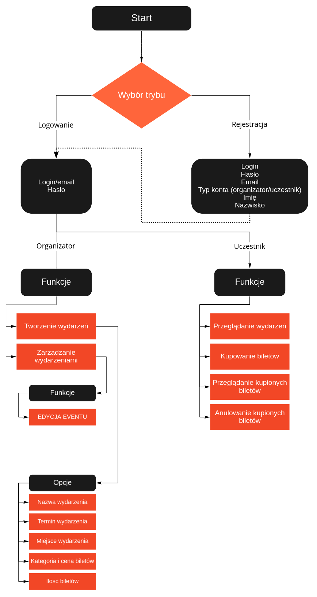

# EasyVENTER

## Skład zespołu
- Łukasz Szarejko
- Patryk Będkowski
- Szymon Skarzyński
- Marcin Grabysz

## Wstęp
Aplikacja będzie platformą do zakupu biletów na wydarzenia sportowe.
Dostępne będą dwa tryby dostępu. Organizatorzy imprez za pomocą aplikacji
będą mogli publikować informacje na temat wydarzeń, a zwykli użytkownicy
będą mieć możliwość przeglądania listy nadchodzących wydarzeń, zakupu biletów, a także zarządzania tymi, które już posiadają (np. anulowanie biletu).

## Architektura rozwiązania

### Program
Aplikacja desktopowa napisana w Javie przy pomocy Swinga
- Moduł logowania/rejestracji przy uruchomieniu aplikacji
- Przeglądarka wydarzeń z możliwością kupienia biletu
- Moduł do zarządzania biletami
- Moduł do tworzenia wydarzeń

### Wstępne plany bazy danych
1. Wydarzenia: ID, miejsce, data, godzina, nazwa, id organizatora, bilety
2. Bilety: ID, typ, miejsce, sektor, cena
3. Organizatorzy: ID, nazwa, login, hasło, email, wydarzenia organizowane
4. Klienci: ID, imię, nazwisko, login, hasło, email, kupione bilety

### Diagram funkcjonalności aplikacji

